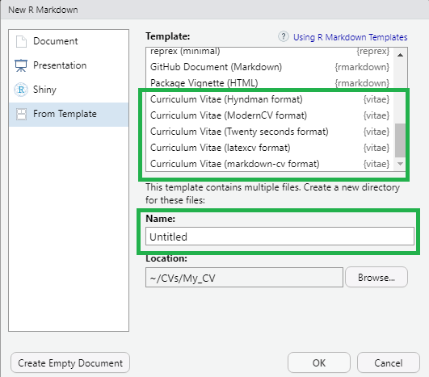

# 1. Introducción 

En esta página veremos como generar un CV utilizando el paquete `vitae`. 
Es una adaptación al español del tutorial : <https://www.youtube.com/watch?v=Fc1RwRskk08&ab_channel=R-LadiesMelbourne>

## 1.1. Libreria `vitae` en `R`
El primer paso sería instalar el paquete usando el siguiente comando:

```
install.packages("vitae")
```
*Nota: Tené en cuenta que este paquete necesita tener instalado LaTex en tu computadora. Si no lo tienes, puedes correr el siguiente código:*
```
install.packages("tinytex")
tinytex::install_tinytex()
```
Para otros Sistemas Operativos (OS) chequear en el repo: 

Una vez instalado se debe cargar la libreria

```
library(vitae)
```

## 1.2. Crear CV modelo

Desde el IDE de RStudio crear un nuevo documento de Rmarkdown desde el menú: `File -> New File -> R Markdown -> From Template`.

Elijo algun modelo de CV dentro del paquete vitae y lo nombro (Ver imagen). Puedes darle un vistazo previo a los modelos de CVs disponible en el [repositorio] (https://github.com/mitchelloharawild/vitae#templates) del paquete 'vitae' : 



# 2. Edición del template

El archivo descargado consta de diferentes partes,
un header (YAML)
un body

AGREGAR AQUI IMADEN DEL PDF DEL CV CON LAS DISTINTAS PARTES QUE LOS FORMAN

# 3. Cargar información del CV desde el Excel
funcion para editar el excel
```
# install.packages("readxl") # Descomentar esta linea para instalar el paquete
library(readxl)
readExcelSheets <- function(filename){
  # leer todas las hojas del documento excel 
  all <- readxl::excel_sheets(filename)
  # importar cada hoja a una lista mediante el comando readxl::read_excel
  list <- lapply(all, function(x) readxl::read_excel(filename, sheet = x))
  # guardar el nombre de la hoja como nombre de los elementos de la lista
  names(list) <- all
  # separa los elementos de la lista en distintos dataframe nombrados de acuerdo al nombre de cada hoja
  list2env(list, envir = .GlobalEnv)
}
```
aplico la funcion usando el paquete here

```
filename <- here::here("example_vitae_data.xlsx")
readExcelSheets(filename)
```
# Creando una sección del CV
```
library(tibble)
tribble(
  ~ Degree, ~ Year, ~ Institution, ~ Where,
  "Informal studies", "1889-91", "Flying University", "Warsaw, Poland",
  "Master of Physics", "1893", "Sorbonne Université", "Paris, France",
  "Master of Mathematics", "1894", "Sorbonne Université", "Paris, France"
) %>% 
  detailed_entries(Degree, Year, Institution, Where)
```

# para crear la sección lo que haremos es:
```
education %>% 
  detailed_entries(what = degree,
                   when = year,
                   with = institution,
                   where = where,
                   why = details)
```
